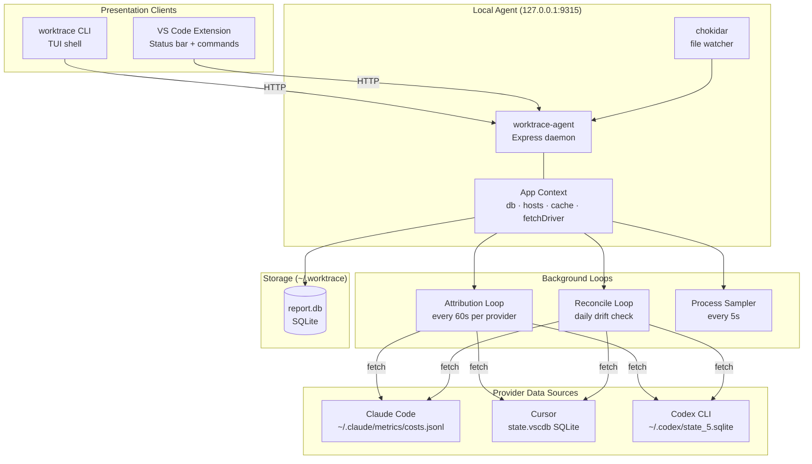
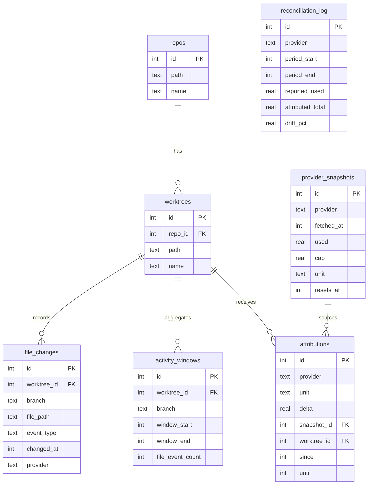

# Architecture

Worktrace v0.1 — local-first AI usage intelligence for developers.

---

## System Topology



---

## Data Model



---

## Monorepo Layout

```
cursor-sm/
├── ARCHITECTURE.md          # this file
├── README.md                # project overview and quickstart
├── CLAUDE.md                # AI assistant instructions
│
├── cli/                     # npm workspace root
│   ├── package.json         # workspace definition
│   ├── tsconfig.base.json   # shared TS config
│   │
│   ├── packages/agent/      # worktrace-agent daemon
│   └── packages/cli/        # worktrace CLI (TUI)
│
├── extension/               # VS Code extension
│
└── docs/
    └── superpowers/
        ├── specs/           # design specifications
        └── plans/           # implementation plans
```

---

## Package: `packages/agent`

The long-running Express daemon. Clients (CLI, extension) talk to it over HTTP on `127.0.0.1:9315`.

```
src/
├── server.ts                # Express app, route mounting, daemon lifecycle
├── daemon.ts                # ensureAgent — start daemon if not running, health-check
├── watcher.ts               # chokidar file-change listener → activity_windows
│
├── providers/
│   ├── _host/               # low-level OS/host adapters
│   │   ├── browser-cookies.ts   # read + decrypt browser cookies (Chrome/Firefox)
│   │   ├── http.ts              # fetch wrapper with timeout + retry
│   │   ├── keychain.ts          # macOS Keychain access for cookie decryption
│   │   ├── logger.ts            # structured logger (pino)
│   │   ├── playwright.ts        # headless browser for cookie extraction
│   │   ├── process-patterns.ts  # detect running AI tool processes
│   │   ├── process-sampler.ts   # poll /proc or ps for CPU/mem snapshots
│   │   ├── pty.ts               # spawn CLI tools in a pseudo-TTY
│   │   ├── status.ts            # provider availability status helpers
│   │   ├── token-cost.ts        # token → USD conversion
│   │   ├── token-cost-models.ts # per-model pricing table
│   │   └── index.ts             # barrel export
│   │
│   ├── _shared/             # framework types shared by all providers
│   │   ├── types.ts             # UsageSnapshot, ProviderDescriptor, Strategy interfaces
│   │   ├── descriptor.ts        # base ProviderDescriptor helpers
│   │   ├── registry.ts          # ProviderRegistry — load + probe all providers
│   │   ├── fetch-driver.ts      # FetchDriver — route requests to correct provider
│   │   ├── fetch-pipeline.ts    # runPipeline — strategy waterfall with cache + fallback
│   │   ├── fetch-strategy.ts    # FetchStrategy base class
│   │   └── cache.ts             # in-memory TTL cache for snapshots
│   │
│   ├── claude/              # Claude Code provider
│   │   ├── descriptor.ts        # quota metadata, strategy list, display config
│   │   ├── strategies.ts        # localLogScan · apiKeyHttp · cliPty · cookieApi
│   │   ├── parser.ts            # parse costs.jsonl and Claude web API responses
│   │   └── models.ts            # Claude model ID → display name map
│   │
│   ├── cursor/              # Cursor provider
│   │   ├── descriptor.ts        # quota metadata, strategy list
│   │   ├── strategies.ts        # localConfigScan (state.vscdb) · cookieApi
│   │   ├── parser.ts            # parse Cursor DB rows and usage-summary API
│   │   └── models.ts            # Cursor model IDs
│   │
│   └── codex/               # OpenAI Codex CLI provider
│       ├── descriptor.ts        # quota metadata, strategy list
│       ├── strategies.ts        # localStateScan · cliPty · whamApi
│       ├── parser.ts            # parse state_5.sqlite and wham/usage API
│       └── models.ts            # Codex model IDs
│
├── report/
│   ├── db.ts                    # SQLite migrations and query helpers
│   ├── app-context.ts           # AppContext — shared singleton (db, hosts, cache)
│   ├── attribution-loop.ts      # startAttributionLoops — 60s provider poll
│   ├── attribution-writer.ts    # write attributions rows after delta computation
│   ├── activity-writer.ts       # write file_changes + activity_windows
│   ├── reconcile-loop.ts        # daily drift reconciliation scheduler
│   ├── reconcile.ts             # reconcile logic — compare attributed vs reported
│   ├── pace-calculator.ts       # computePace — burn-rate, ETA, status (ahead/warn/crit)
│   ├── report-service.ts        # aggregate attributions into repo/worktree/feature reports
│   ├── repo-registry.ts         # detect and register git repos from worktrees
│   ├── sample-loop.ts           # process sampler scheduler
│   ├── sample-writer.ts         # write process samples to DB
│   ├── snapshot-writer.ts       # write provider_snapshots rows
│   ├── worktree-scanner.ts      # detect git worktrees from repo root
│   ├── file-utils.ts            # path normalization helpers
│   └── constants.ts             # shared constants (port, intervals, paths)
│
└── routes/
    ├── health.ts                # GET /health — liveness probe
    ├── usage.ts                 # GET /usage — current usage snapshot per provider
    ├── pace.ts                  # GET /pace — burn rate, ETA, quota status
    ├── providers.ts             # GET /providers — available providers + strategies
    ├── report.ts                # GET /report — attributed cost breakdown
    ├── repos.ts                 # GET /repos — registered repos
    ├── worktrees.ts             # GET /worktrees — worktrees per repo
    ├── watch.ts                 # POST /watch — register a path to watch
    ├── features.ts              # GET /features — feature branch attribution
    └── files.ts                 # GET /files — per-file attribution
```

---

## Package: `packages/cli`

Interactive TUI shell built on `neo-blessed`. Entry point: `worktrace` binary.

```
src/
├── index.ts                 # CLI entry — parse args, launch TUI or run one-shot command
├── agent-client.ts          # typed HTTP client wrapping all agent routes
├── messages.ts              # user-facing string constants
├── types.ts                 # shared CLI-side types (mirrors agent snapshot shapes)
├── neo-blessed.d.ts         # ambient type declarations for neo-blessed
│
└── tui/
    ├── app.ts               # root blessed Screen setup, widget mount, main loop
    ├── run.ts               # bootstrap: ensure agent, open TUI, handle exit
    ├── boot-sequence.ts     # animated startup sequence before data loads
    ├── data-client.ts       # polling loop — fetch snapshots and dispatch to reducer
    ├── reducer.ts           # pure state reducer (AppState → Action → AppState)
    ├── actions.ts           # action type definitions
    ├── keymap.ts            # keybinding table (q quit, tab switch panel, etc.)
    ├── view-models.ts       # derive display-ready data from AppState
    ├── widgets.ts           # reusable blessed widget factories (bars, cards, tables)
    ├── theme.ts             # color palette and style constants
    │
    ├── boot-sequence.test.ts
    ├── keymap.test.ts
    ├── reducer.test.ts
    └── view-models.test.ts
```

---

## Package: `extension`

VS Code extension — shows provider quota in the status bar and exposes commands.

```
src/
├── extension.ts             # activate/deactivate, register commands, start poll loop
├── status-bar.ts            # StatusBarItem — format and update quota display
├── agent-client.ts          # HTTP client for agent routes
├── workspace.ts             # detect workspace root, pass to agent /watch
└── types.ts                 # VS Code–side types
```

