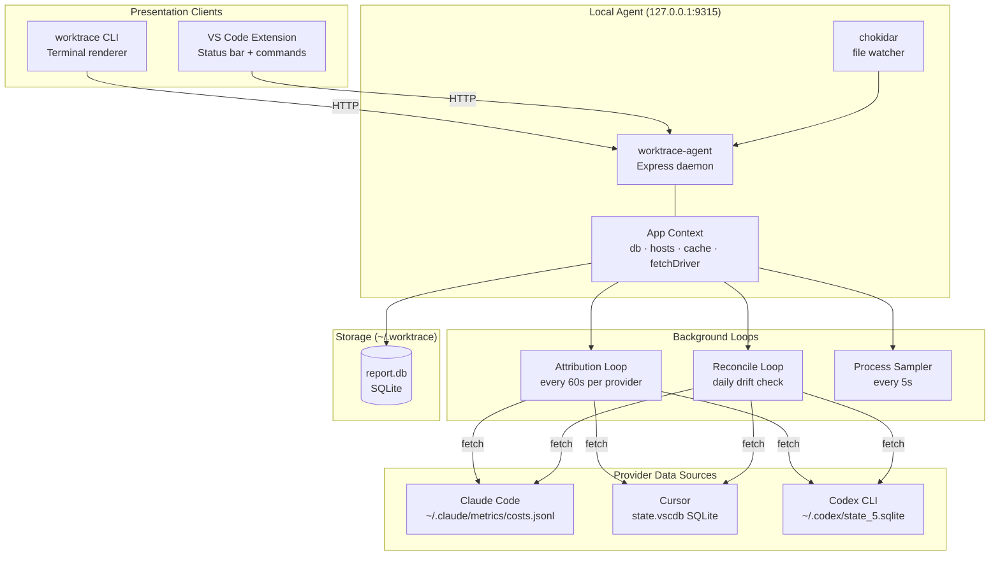
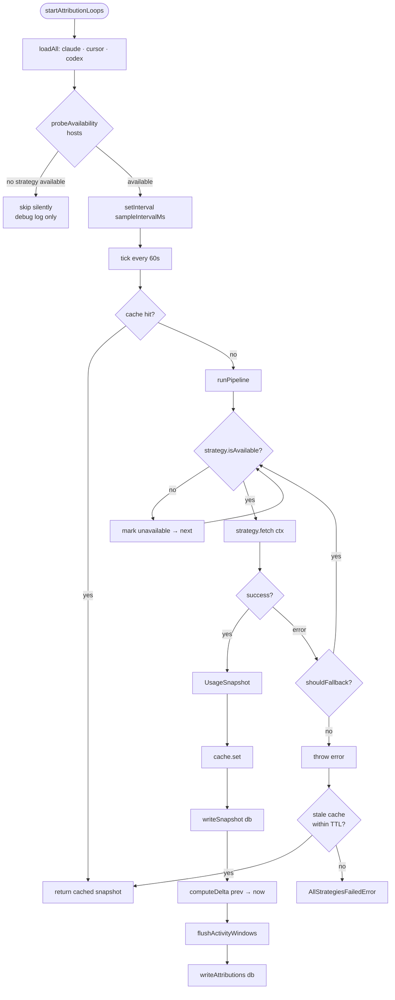
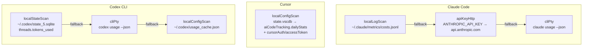
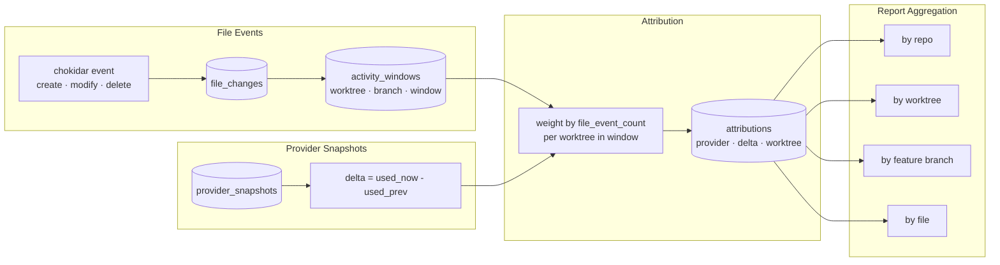
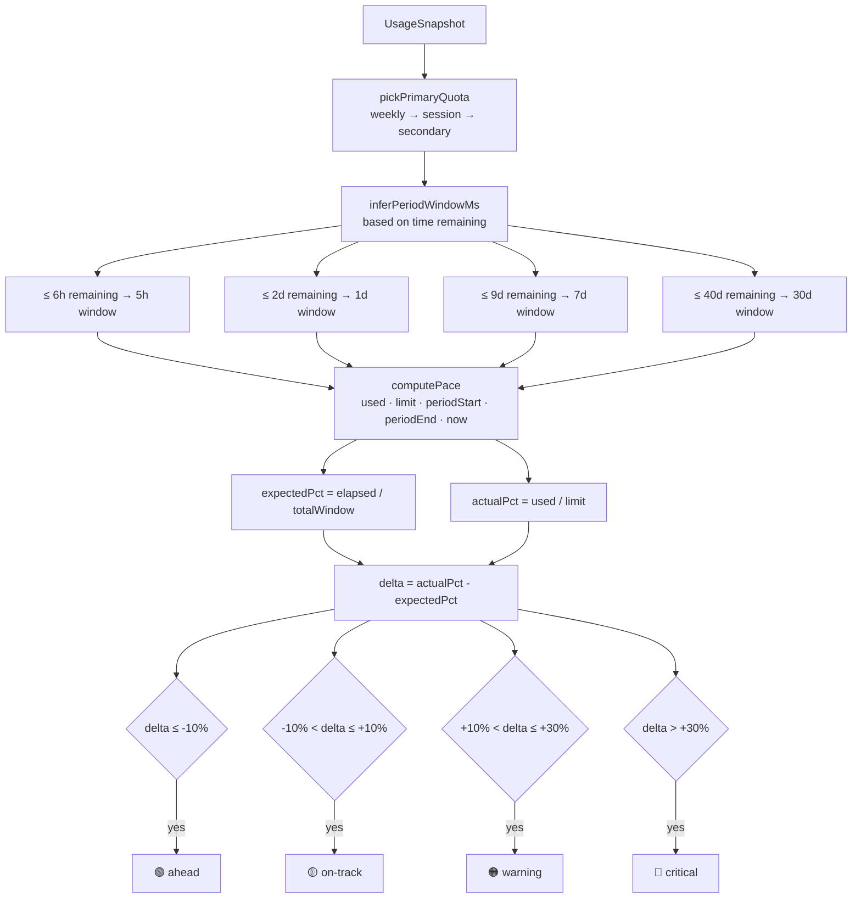
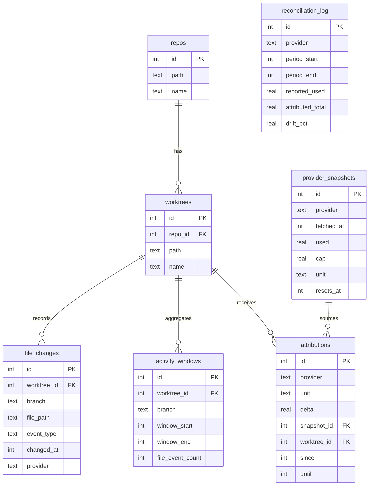
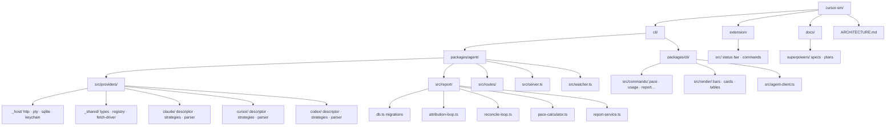

# Architecture

Worktrace v0.1 — local-first AI usage intelligence for developers.

---

## 1) System Topology



---

## 2) Agent HTTP Routes

```mermaid
graph LR
    subgraph "Clients"
        CLI[CLI]
        EXT[Extension]
    end

    subgraph "Agent Routes"
        H[/health]
        W[/watch]
        P[/pace]
        U[/usage]
        PR[/providers]
        R[/report]
        RE[/repos]
        WT[/worktrees]
        FT[/features]
        FI[/files]
    end

    subgraph "Services"
        FD[FetchDriver]
        DB[(SQLite)]
        PC[PaceCalculator]
        RS[ReportService]
    end

    CLI --> H
    CLI --> P
    CLI --> U
    CLI --> PR
    CLI --> R
    EXT --> H
    EXT --> P
    EXT --> W

    P --> FD
    P --> PC
    U --> FD
    PR --> FD
    R --> FD
    R --> RS
    RS --> DB
    W --> DB
    RE --> DB
    WT --> DB
    FT --> DB
    FI --> DB
```

---

## 3) Provider Fetch Pipeline



---

## 4) Strategy Resolution per Provider



---

## 5) Attribution Flow



---

## 6) Pace Calculation



---

## 7) Data Model



---

## 8) Monorepo Layout



---

## 9) Build

```bash
# install
cd cli && npm install

# build all workspaces
npm run build --workspaces
# → packages/agent/dist/
# → packages/cli/dist/

# extension (separate)
cd extension && npm run compile

# run
node packages/agent/dist/server.js &
node packages/cli/dist/index.js pace
```
