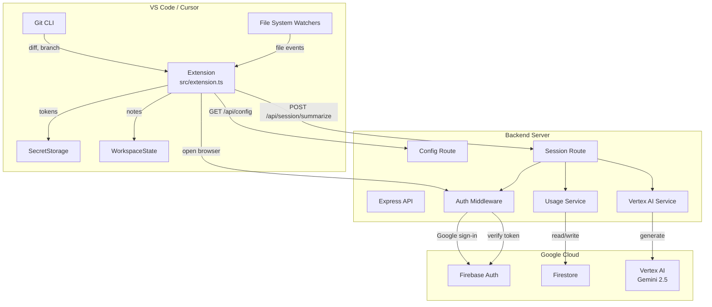

# Architecture

## System Overview



## Extension Internals

### Activation & Tracking

When the extension activates (`onStartupFinished`), it:

1. Creates a `SessionManager` instance that holds per-workspace session state
2. Registers file system listeners for creates, saves, deletes, opens, and changes
3. Registers commands: End Session, Add Note, Sign In, Sign Out
4. Registers a URI handler for the auth callback (`/auth-callback`)
5. Validates backend connectivity by pinging `GET /api/config`

### Session Data Collection

The extension collects:

- **File events**: Every create, save, and delete with timestamp
- **Save counts**: Per-file save frequency
- **Files touched**: All files opened or edited
- **Git diff**: `git diff HEAD` at session end
- **Branch**: `git branch --show-current`
- **User notes**: Manual notes added via command palette

### Delta Builder

`buildSessionDelta()` transforms raw events + git diff into a structured delta:

- **Created files**: Diff added lines + full file content read from disk
- **Updated files**: Added/removed line counts and samples + full current file content
- **Deleted files**: File name + affected dependents (found via `git grep` for import references)

### Deterministic Analysis

All analysis is performed locally without AI:

| Module | Output |
|--------|--------|
| `detectSessionMode()` | Session arc (e.g., "Exploration → Deep Focus → Winding Down") |
| `detectFrictionPoints()` | Rapid saves, high iteration, create-delete cycles, long gaps |
| `buildTomorrowChecklist()` | Actionable next-day checklist based on debug logs, TODOs, uncommitted changes |
| `inferWhatIDidntTouch()` | Categories not modified (tests, docs, config, UI) |
| `computeSessionConfidence()` | Low/Medium/High score with explanation |
| `detectWorkIntent()` | Intent description and ranking of primary focus files |

### Summary Rendering

`renderSessionMemory()` produces a complete Markdown document locally. If the user is signed in and the backend is reachable, `callBackendSummarize()` sends the enriched delta to the backend, and the AI-generated summary replaces the local one.

## Backend Internals

### Server Startup

`backend/src/index.ts` initializes:

1. **Firebase Admin SDK** — wrapped in try/catch for graceful degradation
2. **Express app** with CORS and JSON body parsing
3. **Routes**: `/api/config` (public), `/api/auth` and `/api/session` (guarded by Firebase readiness)

If the Firebase service account is missing, the server starts in **degraded mode** — health and config endpoints work, but auth/session routes return 503.

### Auth Flow

```
Extension                    Backend                     Browser                    Firebase
    |                           |                           |                           |
    |-- open browser ---------->|                           |                           |
    |                           |-- serve auth HTML ------->|                           |
    |                           |                           |-- signInWithPopup ------->|
    |                           |                           |<-- tokens + user info ----|
    |<-- redirect URI scheme ---|<--------------------------|                           |
    |   (idToken, refreshToken, email, userId)              |                           |
    |                           |                           |                           |
    |-- store in SecretStorage  |                           |                           |
```

Token refresh uses the Firebase REST API (`securetoken.googleapis.com`) directly from the extension.

### Session Summarization

`POST /api/session/summarize` flow:

1. **Auth middleware**: Verify Firebase ID token
2. **Usage check**: Ensure user hasn't exceeded their plan's monthly quota
3. **Vertex AI**: Build a detailed prompt with full file context and generate summary
4. **Increment usage**: Update Firestore counters
5. **Return**: Markdown summary

### Vertex AI Prompt

The prompt includes:

- Full file content for every created file
- Full current file content + diff for every updated file
- Affected dependent files (with content) for every deleted file
- Raw git diff for additional context
- All deterministic analysis results (friction, confidence, mode, checklist)

This gives the model complete context to produce descriptions like "Added a new Express config route" rather than just "Created config.ts".

### Usage & Plans

Stored in Firestore under `users/{uid}`:

```json
{
  "plan": "free",
  "usage": {
    "summariesThisMonth": 12,
    "lastReset": "2026-02-01T00:00:00.000Z",
    "lastSummaryAt": "2026-02-22T15:30:00.000Z"
  },
  "createdAt": "2026-01-15T10:00:00.000Z"
}
```

Plan limits: free (50/month), pro (500/month), enterprise (5000/month). Usage resets on month boundary.

## Data Flow: End-to-End

```
1. User codes normally → extension records file events
2. User runs "End Session" command
3. Extension captures git diff + branch
4. buildSessionDelta() reads full file content from disk, finds affected files for deletions
5. analyzeSession() runs all deterministic analysis
6. renderSessionMemory() produces local Markdown summary
7. If signed in:
   a. getStoredIdToken() refreshes Firebase token
   b. callBackendSummarize() sends enriched payload to backend
   c. Backend verifies auth, checks quota, calls Vertex AI
   d. AI summary replaces local summary
8. Summary written to .cursor-sessions/session-{timestamp}.md
9. File opened in editor
```
