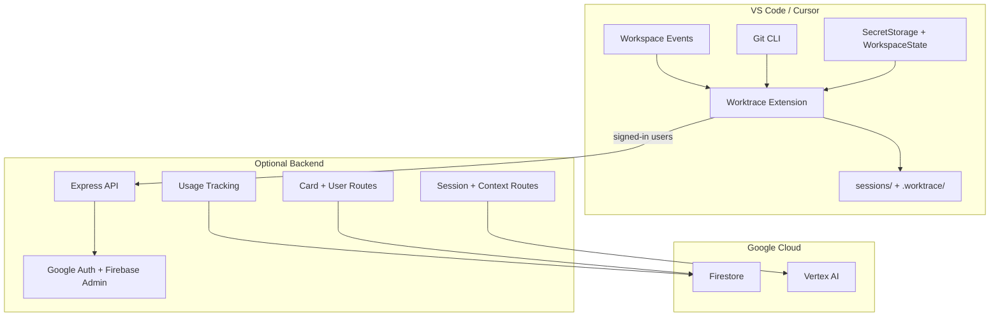

# Architecture

This document describes the architecture that exists in the repo today. The bigger platform in `PRODUCT_ROADMAP.md` includes a future local agent, CLI, and provider-usage intelligence, but those parts are not implemented yet.

## Current System Topology

## What Exists Now

### Extension

The extension is the primary runtime today.

- The extension package lives in `extension/`.
- Activates on `onStartupFinished`.
- Starts per-workspace session tracking immediately.
- Shows a recent-session "where I left off" prompt when local memory exists.
- Registers commands for ending sessions, notes, auth, cards, safety checks, project context, and history search.
- Works without the backend for all local tracking and deterministic summary features.

### Local storage

Worktrace writes two kinds of workspace-local data:

- `sessions/`
  - user-facing outputs such as `session-*.md`, `context.md`, and generated cards
- `.worktrace/sessions.json`
  - compact cross-session memory used for history search, churn detection, recurring friction, and startup continuity

The current architecture is local-first, but not yet multi-client. There is no separate `worktrace-agent` process yet.

### Optional backend

The backend is an enhancement layer, not a requirement for core extension use.

- `GET /api/config` exposes backend availability and Firebase client config.
- `/api/auth` serves the Google sign-in flow.
- `POST /api/session/summarize` generates AI summaries.
- `POST /api/session/context` generates AI project context updates.
- `/api/user` stores and retrieves basic profile data.
- `/api/card` generates shareable cards and reads saved session metadata.

If Firebase service account credentials are missing, the backend starts in degraded mode: health/config routes still work, while Firebase-backed routes return `503`.

## End-to-End Flow

### Local summary flow

1. The user edits files normally.
2. The extension records file events, touched files, save counts, and notes.
3. On `Worktrace: End Session & Generate Summary`, the extension captures git diff and branch.
4. Deterministic analysis computes session mode, friction, confidence, tomorrow checklist, untouched areas, and intent.
5. A basic safety scan runs against the parsed diff.
6. The session is persisted into `.worktrace/sessions.json`.
7. Worktrace generates:
   - a Markdown session summary
   - an updated `sessions/context.md`
8. Files are written into `sessions/` and opened in the editor.

### Signed-in AI flow

When an ID token is available:

1. The extension sends the enriched session payload to the backend.
2. The backend verifies the Firebase token.
3. Quota enforcement runs against Firestore usage counters.
4. Vertex AI generates:
   - the AI session summary
   - the AI project context update
5. The extension replaces local fallbacks with the AI outputs.
6. A shareable card can also be generated from saved backend session data.

If any backend step fails, the extension falls back to the local summary and local context generation path.

## Responsibilities by Layer

### Extension responsibilities

- Workspace event capture
- Git diff and branch capture
- Deterministic analysis
- Local session memory
- Local context generation fallback
- Safety scanning
- History search UI
- Writing user-facing outputs

### Backend responsibilities

- Google auth flow
- Token verification
- AI summary generation
- AI context generation
- Usage quota tracking
- User profile storage
- Saved session metadata for cards and streaks

## Deliberately Not Present Yet

These are roadmap items, not current architecture:

- `worktrace-agent`
- `worktrace` CLI commands
- prompt enhancement / outbound prompt wrapping
- local provider usage collectors
- project-configurable safety rules in `.worktrace/rules.yml`
- dashboard, team, reporting, or export surfaces
