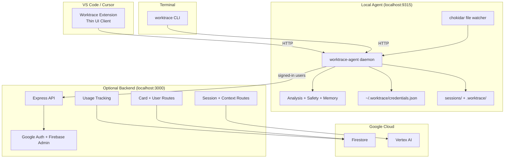

# Architecture

This document describes the architecture that exists in the repo today. The bigger platform in `PRODUCT.md` includes provider-usage intelligence, dashboard, and team features, but those parts are not implemented yet.

## Current System Topology

## What Exists Now

### Agent (`CLI/packages/agent/`)

The agent daemon is the single source of truth for all business logic.

- Runs as a local HTTP daemon on `127.0.0.1:9315`.
- Owns session lifecycle, file watching (chokidar), deterministic analysis, safety monitoring, cross-session memory, context generation, and credential storage.
- Both the extension and CLI are thin HTTP clients that delegate to the agent.
- Stores credentials in `~/.worktrace/credentials.json` (shared between extension and CLI).
- Auto-started by the extension on activation or by the CLI on first command.

### Extension (`Extension/src/`)

The extension is a thin VS Code UI client.

- The extension package lives in `Extension/`.
- Activates on `onStartupFinished`, auto-starts the agent daemon via `ensureAgent()`.
- Delegates all business logic to the agent via HTTP (session start/end, auth, safety, history, context, cards).
- Provides VS Code-native UI: status bar, notifications, quick picks, text document viewers, and URI handler for auth callbacks.
- Registers 9 commands for ending sessions, notes, auth, cards, safety checks, project context, and history search.
- Contains only 4 source files: `extension.ts`, `agent-client.ts`, `types.ts`, `workspace.ts`.

### CLI (`CLI/packages/cli/`)

The CLI is a thin terminal client.

- Provides 9 commands: `start`, `end`, `status`, `context`, `history`, `check`, `note`, `login`, `card`.
- Auto-starts the agent daemon if not running.
- Matrix-themed terminal UX with typing effects, spinners, and gradient banners.

### Local storage

Worktrace writes two kinds of workspace-local data:

- `sessions/`
  - user-facing outputs such as `session-*.md`, `context.md`, and generated cards
- `.worktrace/sessions.json`
  - compact cross-session memory used for history search, churn detection, recurring friction, and startup continuity

Agent credentials are stored in `~/.worktrace/credentials.json` (shared across all workspaces and clients).

### Optional backend

The backend is an enhancement layer, not a requirement for core use.

- `GET /api/config` exposes backend availability and Firebase client config.
- `/api/auth` serves the Google sign-in flow.
- `POST /api/session/summarize` generates AI summaries.
- `POST /api/session/context` generates AI project context updates.
- `/api/user` stores and retrieves basic profile data.
- `/api/card` generates shareable cards and reads saved session metadata.

If Firebase service account credentials are missing, the backend starts in degraded mode: health/config routes still work, while Firebase-backed routes return `503`.

## End-to-End Flow

### Local summary flow

1. The user edits files normally.
2. The agent's chokidar watcher records file events, touched files, save counts, and notes.
3. On `Worktrace: End Session & Generate Summary`, the extension sends `POST /session/end` to the agent.
4. The agent runs the full pipeline: delta → deterministic analysis → safety scan → render.
5. The session is persisted into `.worktrace/sessions.json`.
6. The agent generates:
   - a Markdown session summary
   - an updated `sessions/context.md`
7. Files are written into `sessions/` and the extension opens the summary in the editor.

### Signed-in AI flow

When the agent has stored credentials:

1. The agent sends the enriched session payload to the backend.
2. The backend verifies the Firebase token.
3. Quota enforcement runs against Firestore usage counters.
4. Vertex AI generates:
   - the AI session summary
   - the AI project context update
5. The agent replaces local fallbacks with the AI outputs.
6. A shareable card can also be generated from saved backend session data.

If any backend step fails, the agent falls back to the local summary and local context generation path.

### Auth flow

Two login paths share the same credential store:

- **CLI flow**: Agent opens browser → local HTTP callback server → credentials saved to `~/.worktrace/credentials.json`.
- **Extension flow**: Extension requests auth URL with `scheme` param → browser opens → backend redirects to `vscode://` or `cursor://` URI → extension URI handler forwards tokens to agent via `POST /auth/callback` → credentials saved.

## Responsibilities by Layer

### Agent responsibilities

- Session lifecycle (start, end, note, status)
- File event capture (chokidar watcher)
- Git diff and branch capture
- Deterministic analysis
- Safety scanning
- Cross-session memory
- Context generation
- Credential storage and token refresh
- Backend communication (AI summaries, cards, user profile)

### Extension responsibilities

- Auto-start the agent daemon
- VS Code UI: status bar, notifications, quick picks, text viewers
- URI handler for auth callbacks
- Command palette registration (9 commands)

### CLI responsibilities

- Auto-start the agent daemon
- Terminal UX: spinners, typing effects, gradient banners
- 9 commands mapping to agent HTTP routes

### Backend responsibilities

- Google auth flow (sign-in page)
- Token verification
- AI summary generation
- AI context generation
- Usage quota tracking
- User profile storage
- Saved session metadata for cards and streaks

## Deliberately Not Present Yet

These are roadmap items, not current architecture:

- prompt enhancement / outbound prompt wrapping
- local provider usage collectors
- project-configurable safety rules in `.worktrace/rules.yml`
- dashboard, team, reporting, or export surfaces
